# OSProject Running Containers for Application Development

Group Name: OAS
Section: 4. 

Team Mates:
1. ADLIN HAFIDZ BIN JAMAL SHUPARDI (2112133)


***Questions:***

1. What is the link of the fork OSProject in your repository. ***(1 mark)*** (https://github.com/AdlinHFDZ/OSProject.git).
2. How many files and folders are in this repository. ***(1 mark)*** 6 file and 1 folder.


***Questions:***

Look at the TERMINAL tab. Run the following commands and provide the output here. 

1. Run the command **pwd** . ***(1 mark)***

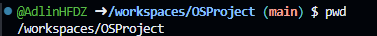

2. Run the command **cat /etc/passwd** . ***(1 mark)***

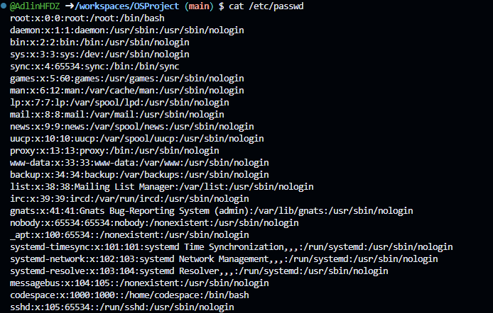

3. Run the command **df** . ***(1 mark)***

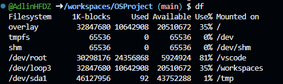

4. Run the command **du** . ***(1 mark)***

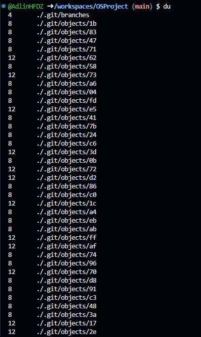

5. Run the command **ls** . ***(1 mark)***

6. Run the command **ls -asl** . ***(1 mark)***

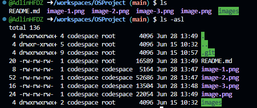

7. Run the command **free -h** . ***(1 mark)***

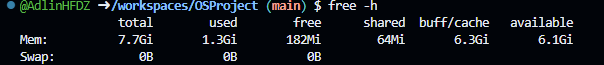

8. Run the command **cat /proc/cpuinfo** . ***(1 mark)***

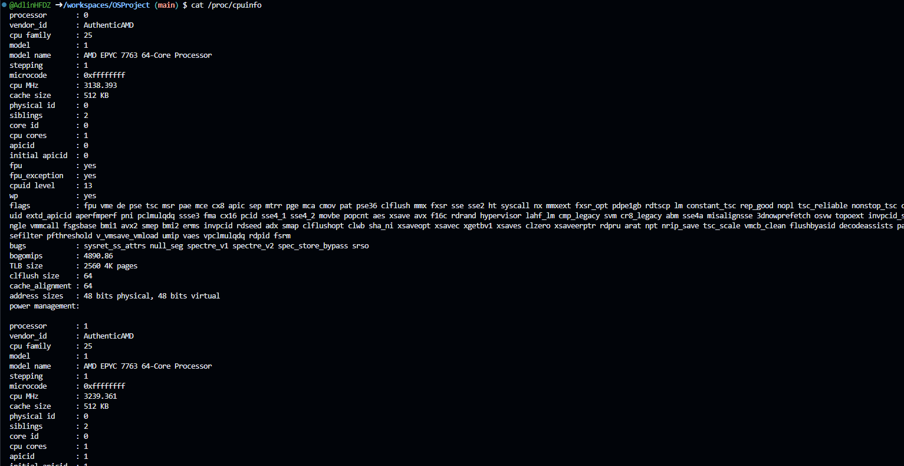

9. Run the command **top** and type **q** to quit. ***(1 mark)***

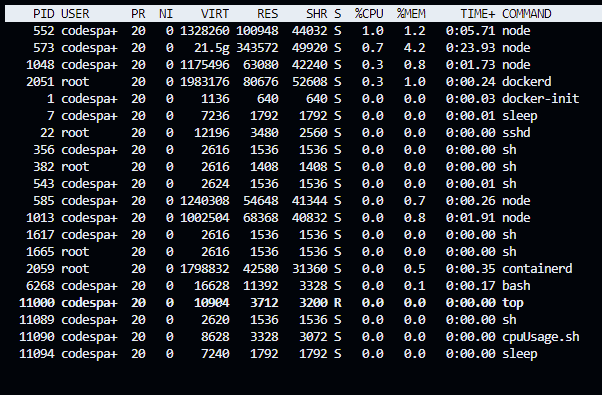

10. Run the command **uname -a**. ***(1 mark)***

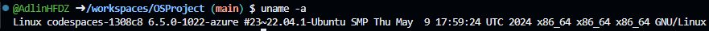

11. What is the available free memory in the system? (1 mark)
Answer: 182 MiB.

12. What is the available disk space mounted on /workspace? (1 mark)
Answer: 6.1 GiB.

13. Name the version and hardware architecture of the Linux Virtual environment. (1 mark)
Answer: Ubuntu 22.04.1, x86_64 architecture.

14. What is the difference between ls vs ls -asl? (1 mark)
Answer:
- `ls`: Lists files and directories in the current directory.
- `ls -asl`: Provides a detailed listing of all files (including hidden ones) in the current directory, showing their sizes in blocks and additional metadata like permissions and ownership.

15. What is the TLB size of the Virtual CPU? (1 mark)
Answer: Fill answer here (This part needs to be filled with the actual answer).

16. What is the CPU speed of the Virtual CPU? (1 mark)
Answer: 3.14 GHz.

17. What is the top running process that consumes the most CPU cycles? (1 mark)
Answer: Node.js process (PID 573), consuming 3.3% CPU.


***Questions:***

1. Are files in the container persistent. Why not?. ***(1 mark)*** answer: Files inside a container are not persistent by default because containers are designed to be ephemeral and stateless. When a container is stopped or deleted, any changes made inside the container, including created files like helloworld.txt, are lost..
2. Can we run two, or three instances of debian linux? . ***(1 mark)*** answer: yes, you can run multiple instances of Debian Linux containers simultaneously..

***Questions:***

1. Check the permission of the files created in myroot, what user and group is the files created in docker container on the host virtual machine? . ***(2 mark)*** 

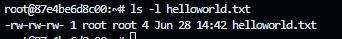.

2. Can you change the permission of the files to user codespace.  You will need this to be able to commit and get points for this question. ***(2 mark)***

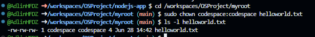
```bash
answer:
Changing Ownership (chown command):

sudo chown codespace:codespace helloworld.txt: This command changes the ownership of helloworld.txt to the user codespace and the group codespace.
sudo: Ensures that the command runs with superuser (root) privileges, necessary for changing file ownership.
```

## You are on your own, create your own static webpage


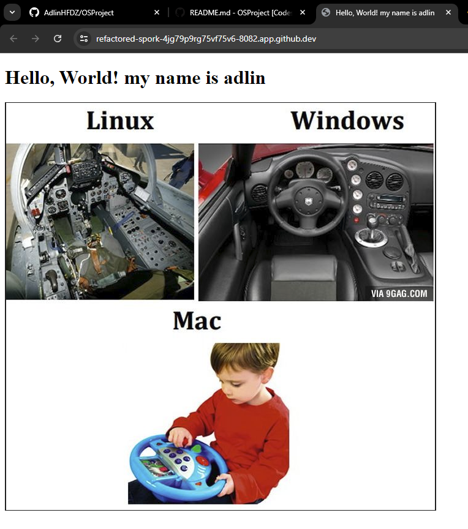


***Questions:***

1. What is the permission of folder /usr/local/apache/htdocs and what user and group owns the folder? . ***(2 mark)*** 

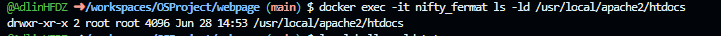.


2. What port is the apache web server running. ***(1 mark)***

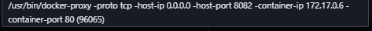.


3. What port is open for http protocol on the host machine? ***(1 mark)***
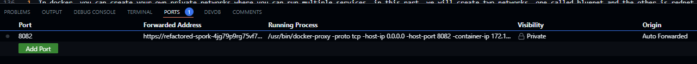.

## Create SUB Networks

1. In docker, you can create your own private networks where you can run multiple services, in this part, we will create two networks, one called bluenet and the other is rednet
2. Run the docker create network to create you networks like the ones below
```bash
## STEP 1:
## Create Networks ##
docker network create bluenet
docker network create rednet`

## STEP 2: (automatically running)
## Create (1) Container in background called "c1" running busybox image ##
docker run -itd --net bluenet --name c1 busybox sh
docker run -itd --net rednet --name c2 busybox sh
```
***Questions:***

1. Describe what is busybox and what is command switch **--name** is for? . ***(2 mark)*** 
```bash
answer:
Busybox: Busybox is a lightweight Linux distribution that provides a collection of common UNIX utilities in a single executable file. It is often used in Docker containers where minimalism and efficiency are prioritized.
--name switch: This option allows you to specify a name for the container when you create it using docker run. It provides a human-readable identifier that can be used instead of the container ID.
```

2. Explore the network using the command ```docker network ls```, show the output of your terminal. ***(1 mark)*** 

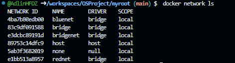.


3. Using ```docker inspect c1``` and ```docker inspect c2``` inscpect the two network. What is the gateway of bluenet and rednet.? ***(1 mark)*** 
```bash
    {
        "Name": "rednet",
        "Id": "e1bb513a8957cae0227ed1465200a6bc88253da299a6b9e3b93fe7b7bcaf3592",
        "Created": "2024-06-28T15:06:37.206360576Z",
        "Scope": "local",
        "Driver": "bridge",
        "EnableIPv6": false,
        "IPAM": {
            "Driver": "default",
            "Options": {},
            "Config": [
                {
                    "Subnet": "172.19.0.0/16",
                    "Gateway": "172.19.0.1"
                }
            ]
        },
```
```bash
    {
        "Name": "bluenet",
        "Id": "4ba7b80edb000e4731a61edaba4070ea15622353802c594b20f669123980ef3d",
        "Created": "2024-06-28T15:03:49.729432232Z",
        "Scope": "local",
        "Driver": "bridge",
        "EnableIPv6": false,
        "IPAM": {
            "Driver": "default",
            "Options": {},
            "Config": [
                {
                    "Subnet": "172.18.0.0/16",
                    "Gateway": "172.18.0.1"
                }
            ]
        },
```

4. What is the network address for the running container c1 and c2? ***(1 mark)*** 
```bash
@AdlinHFDZ ➜ /workspaces/OSProject/myroot (main) $ docker inspect -f '{{range .NetworkSettings.Networks}}{{.IPAddress}}{{end}}' c1
172.18.0.2172.20.0.2
@AdlinHFDZ ➜ /workspaces/OSProject/myroot (main) $ docker inspect -f '{{range .NetworkSettings.Networks}}{{.IPAddress}}{{end}}' c2
172.20.0.3172.19.0.2.
```

5. Using the command ```docker exec c1 ping c2```, which basically tries to do a ping from container c1 to c2. Are you able to ping? Show your output . ***(1 mark)*** 

no, i wont able to ping:

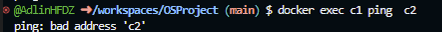.

## Bridging two SUB Networks
1. Let's try this again by creating a network to bridge the two containers in the two subnetworks
```
docker network create bridgenet
docker network connect bridgenet c1
docker network connect bridgenet c2
docker exec c1 ping c2
```
***Questions:***

1. Are you able to ping? Show your output . ***(1 mark)*** 

yes! i be able to ping now>

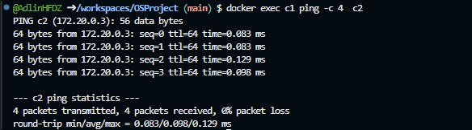.

2. What is different from the previous ping in the section above? ***(1 mark)*** 

it say bad ping, now the ping can be ping.

## Intermediate Level (10 marks bonus)

### Node.js and MySQL in Docker Containers

This guide will help you set up a simple Node.js website that retrieves a random row from a MySQL database. Both the MySQL server and the Node.js server will run in separate Docker containers on two separate networks. Your job is to make it work by making the two containers in two separate network bridged together.

#### Step 1: Set Up the Docker Network

Create a Docker network to for the two containers.
For mysql, call it **mysqlnet** for nodejs call it **nodejsnet** .

#### Step 2: Set Up the MySQL Container

Run a MySQL container on the created network.

```sh
docker run --name mysql-container --network mysqlnet -e MYSQL_ROOT_PASSWORD=rootpassword -e MYSQL_DATABASE=mydatabase -e MYSQL_USER=myuser -e MYSQL_PASSWORD=mypassword -d mysql:latest
```

#### Step 3: Set Up the Node.js Container

1. **Create a directory for your Node.js application and initialize it.**

    ```sh
    mkdir nodejs-app
    cd nodejs-app
    npm init -y
    npm install express mysql
    ```

2. **Create a file named `index.js` with the following content:**

    ```js
    const express = require('express');
    const mysql = require('mysql');

    const app = express();
    const port = 3000;

    // Create a MySQL connection
    const connection = mysql.createConnection({
      host: 'mysql-container',
      user: 'myuser',
      password: 'mypassword',
      database: 'mydatabase'
    });

    // Connect to MySQL
    connection.connect((err) => {
      if (err) {
        console.error('Error connecting to MySQL:', err);
        return;
      }
      console.log('Connected to MySQL');
    });

    // Define a route to get a random row
    app.get('/random', (req, res) => {
      const query = 'SELECT * FROM mytable ORDER BY RAND() LIMIT 1';
      connection.query(query, (err, results) => {
        if (err) {
          console.error('Error executing query:', err);
          res.status(500).send('Server Error');
          return;
        }
        res.json(results[0]);
      });
    });

    // Start the server
    app.listen(port, () => {
      console.log(`Server running at http://localhost:${port}`);
    });
    ```

3. **Create a Dockerfile for the Node.js application:**

    ```Dockerfile
    # Use the official Node.js image
    FROM node:14

    # Create and change to the app directory
    WORKDIR /usr/src/app

    # Copy application dependency manifests to the container image
    COPY package*.json ./

    # Install production dependencies
    RUN npm install

    # Copy local code to the container image
    COPY . .

    # Run the web service on container startup
    CMD [ "node", "index.js" ]
    ```

#### Step 4: Build and Run the Node.js Container

1. **Build the Docker image for the Node.js application.**

    ```sh
    docker build -t nodejs-app .
    ```

2. **Run the Node.js container on the same network as the MySQL container.**

    ```sh
    docker run --name nodejs-container --network nodejsnet -p 3000:3000 -d nodejs-app
    ```

#### Step 5: Test the Setup

You can now test the setup by accessing the Node.js application in your browser or using a tool like `curl`:

```sh
curl http://localhost:3000/random
```

#### Step 6: Ensure `mytable` is Populated

Make sure you have created the `mytable` table and populated it with some data in your MySQL database for the above steps to work correctly.

You can use the following SQL commands to create and populate the table (run these commands in the MySQL container):

```sql
CREATE TABLE mytable (
  id INT AUTO_INCREMENT PRIMARY KEY,
  name VARCHAR(255) NOT NULL,
  value VARCHAR(255) NOT NULL
);

INSERT INTO mytable (name, value) VALUES ('example1', 'value1'), ('example2', 'value2'), ('example3', 'value3');
```

### Summary

You have now set up a Node.js application in a Docker container on nodejsnet netowrk and a MySQL database in another Docker container on mysqlnet network. Now bridge the two network together.

***Questions:***

1. What is the output of step 5 above, explain the error? ***(1 mark)*** __Fill answer here__.
2. Show the instruction needed to make this work. ***(1 mark)*** __Fill answer here__.


## What to submit

1. Make sure to commit all changes on your source control, and make sure your source control is sync to the repository. 
2. Check your repository link, to see if all the files and answers are included in the repository. 
3. Submit through italeem, by providing the link to your repository.
4. Due by ***AS STATED IN ITALEEM SYSTEM***
